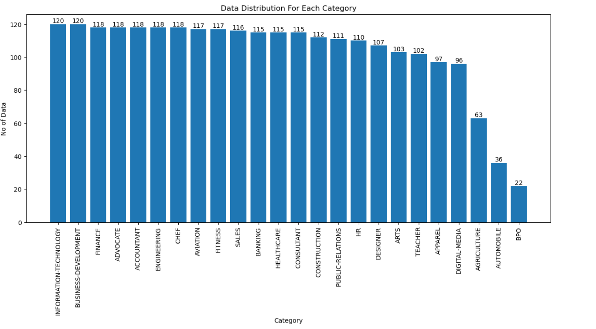

# Resume_Classification
A deep-learning based project for Resume Classification


## Table of Contents
- [Resume_Classification](#resume-classification)
  - [Table of Contents](#table-of-contents)
  - [Problem Statement](#problem-statement)
  - [Solution Approach](#solution-approach)
  - [Datasets](#datasets)
  - [Preprocessing](#preprocessing)
  - [Modeling](#modeling)
  - [Results](#results)
  - [Setup](#setup)
  - [Run Training](#run-training)
  - [Testing](#testing)
  - [Run in Colab](#commands-to-run-in-colab)

### Problem Statement
Design, implement, and train a machine learning model to automatically categorize resumes based on their domain (e.g., sales, marketing, etc.).


### Solution Approach
Please follow this [notebook](/resume-classification.ipynb) for details solution approach [EDA, Training, Testing]

 ##### N.B: Coding is done in `python` and `pytorch` was used as ML framework.

### Datasets
For the task this open source [dataset](https://www.kaggle.com/datasets/snehaanbhawal/resume-dataset) was suggested and used for training and evaluation.


The dataset is arranged in a `.csv` file. This dataset contains 4 columns. They are described as, <br>
* ID: Unique identifier and file name for the respective resume.
* Resume_str : Contains the resume text only in string format.
* Resume_html : Contains the resume data in html format as present while web scrapping.
* Category : Category of resume.

#### Dataset disribution:
The dataset has total `24` categories of resumes.<br>
Categories: 'ACCOUNTANT','ADVOCATE', 'AGRICULTURE','APPAREL','ARTS','AUTOMOBILE','AVIATION','BANKING','BPO','BUSINESS-DEVELOPMENT','CHEF', 'CONSTRUCTION', 'CONSULTANT', 'DESIGNER','DIGITAL-MEDIA','ENGINEERING','FINANCE','FITNESS', 'HEALTHCARE','HR',     'INFORMATION-TECHNOLOGY','PUBLIC-RELATIONS','SALES','TEACHER' <br>

There are `2484` resumes in total in the dataset. The dataset is small in size. `Training bigger model will be an issue as they needs bigger dataset and tends to overfit.`


<p align="center">
   
</p>


### Preprocessing


#### Exploratory Data Analysis (EDA)
After loading our data, we did some data analysis. First, we check if all the data distribution for each class. After analysis we found that the dataset was slightly imbalanced which point us some constrains for the task, like proper train-test split and proper metrics for evaluation. For our task we have chosen `cross-validation `method for robust model training and `f1_score` as model performance metrics as it gives more general idea that accuracy

We also did other extensive EDA which can be found in this [notebook](./task-resume-classification.ipynb)

#### Train-validation split
For train-validation split, I have used `stratifiedkfold` from `sklearn`. Here I used this split method so that our train valid dataset have properly distributed samples from each class .We have done most of the experimented with 3 fold cross-validation to ensure models robustness. We splited total data into 4 folds and take 1 fold as test data and did 3 fold cv with other 3 folds.


### Modeling

#### Models
For modeling we tried several methods, <br>
First of all we tried a niave approach<br>
**A naive approach** <br>
If someone apply for a certain post, his/her resume will contain more of this position related word. So we will count the occurance of each category words and classify the resume according to the frequency of category occurance.

> This approach result is much better (Accuracy `53.09%` without stopwords and `55.31%` with stopwords) than a random classifier.

Then we tried a traditional ML based methods. We trained a KNN model for our task and got following results <br>

> Result: Train Acc- 0.6414<br>
          Test Acc-  0.5330

So, Traditional ML model doesn't do well for our task. 


Then we tried different deep-learning based model. After the introduction of `transformer` based model there is an huge shift in NLP domain. In every NLP task transformer based model outperforms previous architectures like RNN,LSTM etc. Thats we tried out different transformer based models for the task. There are the lists that was used for experiments for the task.

* [bert-base-uncased](https://huggingface.co/bert-base-uncased)
* [bert-large-uncased](https://huggingface.co/bert-large-uncased)
* [deberta-v3-base](https://huggingface.co/microsoft/deberta-v3-base)
* [deberta-v3-small](https://huggingface.co/microsoft/deberta-v3-small)
* [xlnet-base-cased](https://huggingface.co/xlnet-base-cased)

These models was chosen because of their amazing performance in different NLP tasks.


### Results


| **Model**                            |**max_length**             | **F1 Score** |
|:---------------------------------:|:-------------------------:|:--------------------------------
| bert-base-uncased         | 512                             |84.06         |
| bert-large-uncased        | 512                         | 83.62          |
| deberta-v3-small          | 512                     | 82.56         |
| deberta-v3-base       |      512                   | 83.88          |
| deberta-v3-base       |      1024                   | 86.85          |
| xlnet-base-cased      |      1024                       | 85.5       |


N.B: All the trained weights will be found in this [dataset](https://kaggle.com/datasets/dab8d679eff868203dbfdb4009744c496b1cfee01b8bbb8ef97e783eb7cf650d)
### Running Scripts for training and Inference

#### Directory Introduction

```
Bengali_NER/
├── Data/
    └── Resumes.csv
    └── train_data.csv
    └── test_data.csv
├── utils/
    └── configuration.py 
    └── helper.py
    └── preprocessing.py
├── train.py
├── test.py
├── script.py
├── resume_classification.ipynb
└── requirements.txt

```

* `configuration.py`: Contains all the important hyperameters and configuartion parameters like model_name, model_checkpoint etc. To train with different configuration chage values in this file or pass parameter in command line in proper format.<br>

* `helper.py`: Contains all the helping functions for training and testing
* `preprocessing.py`: Contains all the helper function for data pre-processing.<br>
* `train.py`: Script for training and run training.<br>
* `test.py`: Script for run testing. <br>
* `requirements.txt`: All required module list.
* `resume-classification.ipynb`: All code are combined in one jupyter notebook to run interactively.


 ### Setup

For installing the necessary requirements, use the following bash snippet

```bash
$ git clone https://github.com/VirusProton/Resume_Classification.git
$ cd Resume_Classification/
$ python3 -m venv <env_name>
$ source <env_name>/bin/activate 
$ pip install -r requirements.txt
```

N.B: Please adjust commands if you are running these other than linux terminal i.e. windows cmd or google colab.


### Run Training
To see list of all available options, do `python train.py -h`. There are two ways to provide input data files to the script:

* With flag `--model_name <model_name>` where `<model_name>` refers to a valid name of a huggingface model.
* By editing 'configuration.py' scripts parameters.


#### Finetuning
For finetuning, a minimal example is as follows:<br>

```bash
$ python train.py \
    --model_name "bert-base-uncased" \
    --output_dir "./Models/" \
    --n_folds 3 \
    --num_epochs 3 \
    --learning_rate 2e-5 \
    --scheduler "linear"  \
    --train_batch_size 4 \
    --valid_batch_size 4 \
    --max_length 512 
```

#### Downloading Trained Weights
N.B: All the trained weights will be found in this [dataset](https://kaggle.com/datasets/dab8d679eff868203dbfdb4009744c496b1cfee01b8bbb8ef97e783eb7cf650d) . Please download these weights files and put them into a folder named `Models`. <br>

### Testing
This script run testing on test dataset and returns model prformance (f1_score).<br>

To see list of all available options, do `python test.py -h`

> If you want to run test on already trained model, please run the following command for d

```bash
$ python test.py \
    --model_name "bert-base-uncased" \
    --model_checkpoint "./Models/bert_base/Resume_Classification-0.bin" \
    --test_batch_size 2 \
    --max_length 512 
```

N.B: To run with proper weights and proper model name please follow the following format.

#### Run script.py

```bash
$ python script.py \
    --resume_dir <dir of the resume pdf files> \
```

#### N.B: Please adjust certain commands if you are running these in windows or MacOS


### Commands to run in Colab
Run the following commands to evaluate the whole process.

```
! git clone https://github.com/VirusProton/Resume_Classification.git
%cd Resume_Classification/
! python3 -m venv <env_name>
! source <env_name>/bin/activate 
! pip install -r requirements.txt

#training
# Please change model_name according to your training strategy.
! python train.py \
    --model_name "bert-base-uncased" \
    --output_dir "./Models/" \
    --n_folds 3 \
    --num_epochs 3 \
    --learning_rate 2e-5 \
    --scheduler "linear"  \
    --train_batch_size 4 \
    --valid_batch_size 4 \
    --max_length 512


#Testing
# please provide accurate model_name and its corresponding model_checkpoint correctly
$ python test.py \
    --model_name "bert-base-uncased" \
    --model_checkpoint "./Models/bert_base/Resume_Classification-0.bin" \
    --test_batch_size 2 \
    --max_length 512 

```
